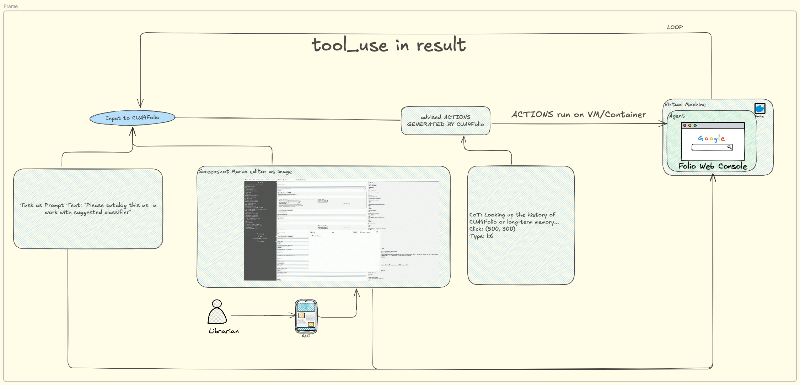

# Computer Use Agent For Folio
Copyright 2025 Autumn Drunken Pomelo

This software is distributed under the terms of the Apache License, Version 2.0. See the file "[LICENSE](LICENSE)" for more information.

## Table of Contents
- [Overview](#overview)
- [Demo](#demo)
- [Features](#features)
  - [Key Components](#key-components)
  - [How CUA4Folio works](#how-cua4folio-works)
  - [Integration test GUI automation](#features)
  - [Monitoring and operation assistance](#features)
  - [Librarian workflow assistance](#features)
- [Benefits](#benefits)
- [Security](#security)
- [Benchmark](#benchmark)
- [Challenges](#challenges)
- [Industry CUA References](#industry-cua-references)
- [Contribute](#contribute)
- [Cite](#cite)
- [Disclaimer](#disclaimer)

# Overview
**CUA4Folio (Computer Use Agent For Folio)** is an innovative initiative aimed at integrating advanced reasoning capabilities of Computer Use Agent into the development and operations of the Folio platform—specifically targeting into GUI testing and monitoring phases.

# Demo
    ongoing...  
# Features
      Pupose-built features include and perhaps not limited to them:

        - Integration test GUI automation
        - Monitoring and operation assistance
        - Librarian workflow assistance

  ## Key Components:

  ## How CUA4Folio works
  Fine-tune LLM/VLM models to understand the captured Folio screenshots, the workflow typically follows two key phases: phase one for parsing the visual information from screenshot, phase two for reasoning about how to interact with it. Phase one "Parsing screenshots accurately" is critical for properly planning how to interact with the next screen and making sure the system reliably executes the tasks in phase two.

  1. Provide LLM/VLM model with computer use tools and user prompt

        Add CUA4Folio-defined computer use tools to the API request, user prompt might indicate requiring these tools, e.g., “Save a picture of a Marva work pane to my desktop.”

  2. CUA4Folio decides to use a tool

        CUA4Folio loads the stored computer use tool definitions and assesses if any tools can help with the user’s query

  3. CUA4Folio extract tool input, evaluate the tool on a computer, and return results: 

      - On CUA4Folio end, extract the tool name and input from input request
      - Use the tool on a container or Virtual Machine
      - Continue the conversation with a new user message containing a tool_result content block

  4. CUA4Folio continues calling computer use tools until it complete the task

      - CUA4Folio analyzes the tool results to determine if more tool use is needed or the task has been completed
      - If CUA4Folio decides it needs another tool, it responds with another tool_use and you should return to step 3
      - Otherwise, generates a text response to the user

  5. Agent
      - Receives CUA4Folio's tool use requests
      - Translates them into actions in the sandbox environment
      - Captures the results (screenshots, command outputs, etc.)
      - Returns these results to CUA4Folio model

# Benefits:
- **Efficiency**: Accelerated development cycles and reduced manual effort
- **Reliability**: Proactive issue resolution and robust performance under load
- **User Experience**: Data-driven insights to refine library workflows or interfaces

# Security:
- Sandboxed environment
  Use a dedicated virtual machine or container with minimal privileges to prevent direct system attacks or accidents
- Denial of attack
  Identify injection prompt screenshots, turn to user for next-step decistion
- Predictive Analytics
  Monitoring logs, metrics to preempt outages or security issues
- Dynamic Resource Management
  Auto-scaling cloud infra based on metrics and resource usage trends

# Benchmark
CUA is still early and has limitations, here are commond benchmark options to evaluates the ability to control full operating systems like Ubuntu, Windows, and macOS:
  - [OSWorld](https://os-world.github.io): Benchmarking Multimodal Agents for Open-Ended Tasks in Real Computer Environments
  - [WebArene](https://webarena.dev): A Realistic Web Environment for Building Autonomous Agents
  - [WebVoyager](https://github.com/MinorJerry/WebVoyager): Building an End-to-End Web Agent with Large Multimodal Models

# Challenges:
- **Integration Complexity**: Balancing GUI automation with existing librarian workflows, well-designed Prompt inspired by expertised librarian
- **General Folio Web Console control**: more Reinforcement Learning 
- **Model Accuracy**: Ensuring VLM-driven scene understanding and LLM-driven decisions are trustworthy and transparent
- **Long term memory**: long term memory in the case of complicated scene, e.g., multi-steps task, else, human-interleave verification
- **Ethical Considerations**: Addressing biases in behavioral models or data usage

# Industry CUA References
  - Anthropic

    - https://docs.anthropic.com/en/docs/agents-and-tools/computer-use
    - https://www.anthropic.com/news/3-5-models-and-computer-use
    - https://www.oneusefulthing.org/p/when-you-give-a-claude-a-mouse
    
  - OpenAI
    - https://openai.com/index/computer-using-agent/
  - Microsoft
    - https://www.gatesnotes.com/AI-agents
  - More

# Contribute
# Cite
# Disclaimer
  This is not an officially supported Folio project but an idea out of my curiority to practise CUA into Folio development. Positioned as an exploratory project, CUA4Folio aligns with trends like CUA and intelligent library system. In essence, CUA4Folio represents a littble bit forward-looking effort to embed intelligence into the development and maintenance of either local-running or cloud-hosting Folio system instance, e.s.p, those test-aimed staging Folio environments.

*README subject to change*
